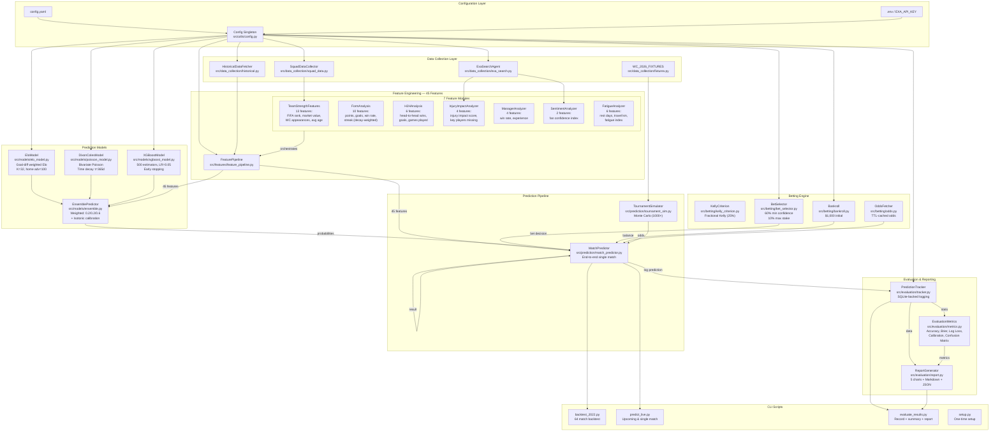
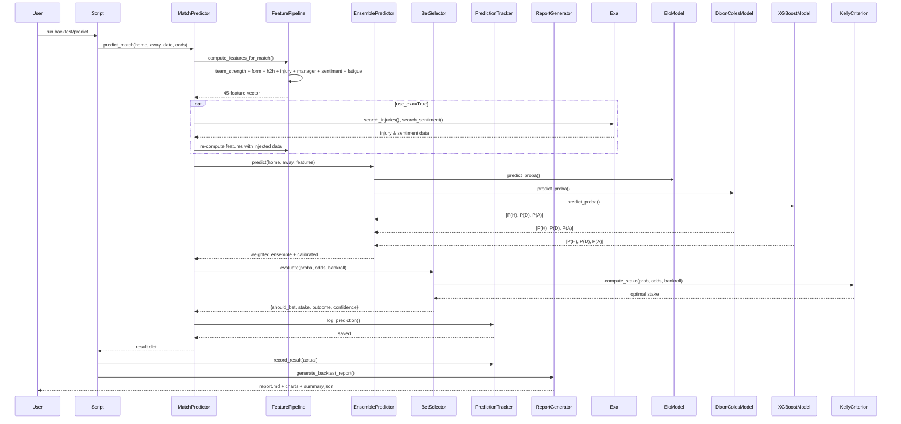

# FifaPredictionAI

**AI agent for FIFA World Cup 2026 match prediction & betting simulation.** Predicts all 104 tournament matches (Win/Draw/Loss) using an ensemble of three models, places simulated bets via Kelly Criterion, and tracks every prediction with full backtest evaluation.

**2022 World Cup Backtest Result: 82.81% accuracy (53/64), 5/5 bets won, +$92.97 P&L (+9.3% ROI)**

## Architecture



## Data Flow



## Project Structure

```
FifaPredictionAI/
├── config.yaml                 # Central configuration
├── requirements.txt
├── .env.example                # EXA_API_KEY template
├── data/
│   ├── cache/                  # TTL-cached Exa search results
│   ├── historical/             # International match data
│   └── team_data/              # Squad & ranking info
├── src/
│   ├── utils/
│   │   ├── config.py           # Singleton config loader (YAML + env)
│   │   └── cache.py            # File-based TTLCache (SHA-256 keyed)
│   ├── data_collection/
│   │   ├── historical.py       # 49K match fetcher (martj42 dataset)
│   │   ├── fixtures.py         # 48 teams, 12 groups, 104 fixtures
│   │   ├── squad_data.py       # FIFA rankings, market values, managers
│   │   └── exa_search.py       # Exa AI: injuries, sentiment, lineup news
│   ├── features/
│   │   ├── feature_pipeline.py # Orchestrator — 45 features per match
│   │   ├── team_strength.py    # FIFA rank, market value, WC exp, age
│   │   ├── form_analysis.py    # Decay-weighted recent form (10 matches)
│   │   ├── h2h.py              # Head-to-head history (5 matches)
│   │   ├── injury_impact.py    # Position-weighted injury impact
│   │   ├── manager_analysis.py # Manager win rate & experience
│   │   ├── sentiment.py        # Fan confidence from web search
│   │   └── fatigue.py          # Rest days + travel distance (Haversine)
│   ├── models/
│   │   ├── elo_model.py        # Goal-difference weighted Elo
│   │   ├── poisson_model.py    # Dixon-Coles bivariate Poisson
│   │   ├── xgboost_model.py    # XGBoost multiclass classifier
│   │   └── ensemble.py         # Weighted ensemble + calibration
│   ├── betting/
│   │   ├── kelly_criterion.py  # Fractional Kelly (default 25%)
│   │   ├── bet_selector.py     # Confidence gating + stake capping
│   │   ├── bankroll.py         # Virtual bankroll management
│   │   └── odds.py             # TTL-cached odds storage
│   ├── prediction/
│   │   ├── match_predictor.py  # End-to-end match prediction
│   │   └── tournament_sim.py   # Monte Carlo tournament simulation
│   └── evaluation/
│       ├── tracker.py          # SQLite prediction logging (22 columns)
│       ├── metrics.py          # Accuracy, Brier, Log Loss, Calibration
│       └── report.py           # Markdown + matplotlib charts + JSON
└── scripts/
    ├── setup.py                # One-time project setup
    ├── backtest_2022.py        # 64-match 2022 WC backtest
    ├── predict_live.py         # Upcoming & single match predictions
    └── evaluate_results.py     # Record results, summary, report
```

## Feature Engineering — 45 Features

| Module | Features | Description |
|--------|----------|-------------|
| **TeamStrength** (13) | `home/away_fifa_rank`, `rank_diff`, `rank_log_ratio`, `home/away_market_value`, `market_value_ratio`, `home/away_wc_appearances`, `wc_exp_diff`, `home/away_avg_age`, `age_diff` | FIFA ranking, squad market value, World Cup experience, squad age |
| **FormAnalysis** (10) | `home/away_form_points`, `form_goals_scored_avg`, `form_goals_conceded_avg`, `form_win_rate`, `form_streak` | Decay-weighted (0.9) recent 10 matches |
| **H2HAnalysis** (6) | `h2h_team1/2_wins`, `h2h_draws`, `h2h_team1/2_goals_avg`, `h2h_games_played` | Last 5 meetings, decay-weighted (0.85) |
| **InjuryImpact** (4) | `home/away_injury_impact`, `home/away_key_players_missing` | Position-weighted (GK=1.0, FWD=0.9, DEF=0.8, MID=0.7) × severity × key player bonus |
| **ManagerAnalysis** (4) | `manager_home/away_win_rate`, `manager_home/away_exp` | Historical win rate + years of experience |
| **Sentiment** (2) | `home/away_fan_confidence` | Positive/negative mention ratio from web search |
| **Fatigue** (6) | `home/away_rest_days`, `home/away_travel_km`, `home/away_fatigue` | Rest deficit + Haversine travel distance blended into fatigue index (0–1) |

## Models

### EloModel
- Standard Elo with K=32, home advantage offset (100 points)
- Goal-difference weighting: `log(max(GD, 1) + 1) × (2.2 / 2.201)`
- Regression toward mean (pull = 0.5 × mean + 0.5 × rating)
- Initial rating: 1500

### DixonColesModel (Bivariate Poisson)
- Attack/defense parameters per team + home advantage + rho (low-score correction)
- Time decay: `2^(-days / 365)` to weight recent matches more
- Maximum likelihood via L-BFGS-B with vectorized negative log-likelihood
- Low-score correction (Dixon-Coles tau) for 0-0, 0-1, 1-0, 1-1 scores

### XGBoostModel
- 500 estimators, max_depth=6, learning_rate=0.05
- Early stopping (20 rounds), StandardScaler normalization
- `multi:softprob` objective, 3 output classes

### EnsemblePredictor
- Weighted blend: 0.2 Elo + 0.2 Poisson + 0.6 XGBoost
- Optional isotonic/sigmoid calibration via `CalibratedClassifierCV(LogisticRegression)`
- Feature matrix from 45 engineered features

## Betting Engine

| Component | Detail |
|-----------|--------|
| **Kelly Criterion** | Full Kelly: `(p×(odds-1) - q) / (odds-1)` × fraction (default 25%) |
| **Min Confidence** | 60% probability required to place a bet |
| **Max Stake** | 10% of current bankroll cap |
| **Min Stake** | $10.00 floor |
| **Initial Bankroll** | $1,000.00 |

## 2022 World Cup Backtest Results

| Metric | Value |
|--------|-------|
| **Accuracy** | 82.81% (53/64 matches correct) |
| **Bets Placed** | 5 |
| **Bets Won** | 5 |
| **Bet Win Rate** | 100% |
| **Total P&L** | +$92.97 |
| **ROI** | +9.3% |

The model correctly predicted major upsets: Japan over Germany, Saudi Arabia over Argentina, Morocco reaching the semi-finals.

## Setup

```bash
# 1. Clone and install
pip install -r requirements.txt

# 2. One-time setup (downloads historical data, creates database)
python scripts/setup.py

# 3. (Optional) Add Exa AI API key for web intelligence
echo "EXA_API_KEY=your_key_here" > .env

# 4. Run 2022 backtest
python scripts/backtest_2022.py

# 5. Predict upcoming WC 2026 matches
python scripts/predict_live.py upcoming

# 6. Predict a single match
python scripts/predict_live.py match --home "Brazil" --away "Argentina" --date 2026-06-15

# 7. Record results & view summary
python scripts/evaluate_results.py record --match "Brazil vs Argentina" --date 2026-06-15 --home-goals 2 --away-goals 1
python scripts/evaluate_results.py summary
```

## Configuration

All tuning parameters in `config.yaml`:

| Section | Key Parameters |
|---------|---------------|
| `data` | Cache TTL, data directories, DB path |
| `exa` | Rate limit (10/min), search type, retries |
| `features` | Form match count (10), decay (0.9), H2H count (5), rest days max (7) |
| `models.elo` | K-factor (32), home advantage (100), regression power (0.5) |
| `models.poisson` | Time decay half-life (365d), max iter (500), low-score correction |
| `models.xgboost` | N estimators (500), max depth (6), LR (0.05), early stopping (20) |
| `models.ensemble` | Calibration method (isotonic), enabled |
| `betting` | Bankroll ($1000), min confidence (60%), Kelly fraction (25%), min/max stake |
| `evaluation` | Confidence buckets, feature snapshots |

## Requirements

- Python 3.10+
- pandas, numpy, scikit-learn, xgboost, scipy
- matplotlib, seaborn (report generation)
- exa-py (optional, for web intelligence)
- SQLAlchemy (SQLite-backed tracking)
- Install: `pip install -r requirements.txt`
- macOS only: `brew install libomp` (XGBoost OpenMP runtime)

## Tournament Format Support

The system is built for the **48-team, 12-group** 2026 format:
- 72 group stage matches (12 groups × 6 matches each)
- Top 2 per group + 8 best third-placed → Round of 32
- Knockout: R32 → R16 → QF → SF → 3rd place → Final
- 104 total fixtures, Monte Carlo simulation (1000×)

## How Web Intelligence Works

When `--exa` flag is enabled, the system searches live web data before each match:
1. Injury news → `InjuryImpactAnalyzer` re-computes with severity/position weights
2. Fan sentiment → `SentimentAnalyzer` counts positive vs negative mentions
3. Lineup news → available but not currently feature-mapped
4. Manager press conferences → available but not currently feature-mapped

Results are TTL-cached (12h) and rate-limited (10 requests/min) to stay within budget.
